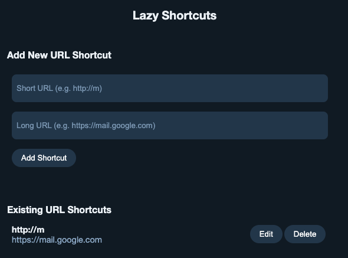

# Lazy Shortcuts


**Lazy Shortcuts** is a Chrome Extension that allows you to create URL shortcuts for
yourself.

For example, you can type `m/` and be redirected to `https://mail.google.com` or
`go/lazy-shortcuts/` to go to `https://github.com/nitobuendia/lazy-shortcuts`.



## User Guide

### Installation

1.  [Build the Chrome Extension zip file](#build).

1.  Uncompress the zip files content into a folder.

1.  [Load the unpacked extension](https://developer.chrome.com/docs/extensions/get-started/tutorial/hello-world#load-unpacked)
    into Google Chrome.

### Use Cases

Lazy Shorcuts is useful to save time in going to certain websites with minimal
action from your side. Think of it as a bookmark that you type.

The use cases are as varied as your needs are, but these are some ideas on how
you can use it:

*   Go to specific documents or articles that you frequently visit.
    Example: open the help center of your bank (`bank/`), the guide for your
    current game (`game-guide/`), or your own life OKRs (`okrs/`).
*   Perform frequent actions. Example: open Google Maps direction towards home
    (`go-home/`), or open a form to input your daily journal (`journal/`).
*   Go to your favourite communities. Example: open your Reddit favourite
    community for Lego (`c/lego/`) or your LinkedIn feed (`l/`).
*   Open your favourite tools. Example: create a new Google Sheet (`ns/`) or
    open the your projects in Figma (`f/`).

> [!NOTE]
> These URL shortcuts are only available on your local browser. You cannot share
> the short URLs with others and expect it to work. This is intentional and by
> design. If you need to share the URL with others, use a URL shortener instead.

### Usage

#### Adding, editing and removing URL Shortcuts

After installing the Chrome Extension, it will appear next to the URL bar. If
you do not see the extension icon
(), click on the jigsaw piece to see all the extensions.

1.  Click Lazy Shorcuts extension icon
    ().
    A popup will open where you can add and change existing URL shortcuts.
    If you want to manage this is in a new window, you can right click the icon
    and click "Options".

1.  To add a new URL shortcut, add the Short URL and Long URL under "Add New URL
    Shortcut" and click "Add Shortcut".

    *   **Short URL** represents the website that you will type on the URL bar.
        The URL can be anything: a simple character (`http://m/`), a phrase
        (`http://my-home/`), a path (`http://go/bank/`), or a fake domain
        (`http://localhost.com/bitwarden`). URLs must start with `http://` or
        `https://`. However, when you type it, you may leave the `http` part
        out. If that's your intention, we recommend you use `http://` plus your
        desired Short URL. Similarly, Google Chrome tends to autocomplete URLs
        based on what you type. One easy way to solve this is by always adding
        (and typing) a final slash (`/`) at the end of the URL. In other words,
        if you want to use the letter `m` as the shortcut, you will add
        `http://m/` as the Short URL and type `m/` on the URL bar to trigger it.

        > Note that the Short URL is sensitive to http vs https and to the final
        > slash: `http://m`, `https://m`, `http://m/` and `https://m/` are
        > all considered separate URLs. If you want to cover all the cases –
        > with and without slashes, with http and https – you may want to add
        > multiple shortcuts with the different Short URLs and the same Long
        > URLs.

    *   **Long URL** represents the website in which you will land when you type
        the Short URL. For example, if you set the short URL to `http://m/` and
        the long URL to `https://mail.google.com/`, when you type `m/` on the
        browser, you will automatically be redirected to
        `https://mail.google.com/`.

1.  Once the URL Shortcut is added, it will appear under "Existing URL
    Shortcuts". You will be able to:

    *   Remove the existing URL shortcut by click `Delete`.
    *   Edit the existing URL shortcut by clicking `Edit`, changing the values
        as described above, then clicking `Save`.

#### Using the URL Shorcuts

Once the URL Shortcuts have been added and appear "Existing URL Shortcuts", all
you have to do is type the Short URL and you will be redirected to the Long URL
for the corresponding Short URL. And, just like that, you have saved yourself
some time typing long URLs, searching for documents, or browsing through your
bookmarks.

If the URL redirection does not happen when you type the Short URL, see the
Short URL guidance on the
[user guide for adding URL Shortcuts](#adding-editing-and-removing-url-shortcuts).
It contains common considerations like `http` vs `https` or the use of the final
slash (`/`).

## Workflows

### Development

Install [Node.js](https://nodejs.org/en). The version of Node.js should match
the `"node"` key in `package.json`.

```sh
# Install dependencies.
npm install
```

### Build

Run the following commands to generate the Chrome Extension files.

```sh
# Create extension files.
npm run build

# Create zip file extension.
npm run package
```

When you run `npm run build` the extension code will be compiled and placed
under the folder `./build/`. You can use this code to load the extension into
Google Chrome ([see installation steps](#installation)). This is useful during
development to quickly test and iterate changes in the extension.

Alternatively, you may run `npm run package` after the build command to create
a zip file with the contents. This will place a zip file under `./dist/`. You
can copy this file to any path that you want, and uncompress it there.
[See installation steps](#installation) for more information.

## Legal Disclaimer

*The software is provided "as is", without warranty of any kind, express or
implied, including but not limited to the warranties of merchantability, fitness
for a particular purpose and noninfringement. In no event shall the authors be
liable for any claim, damages or other liability, whether in an action of
contract, tort or otherwise, arising from, out of or in connection with the
software or the use or other dealings in the software.*
